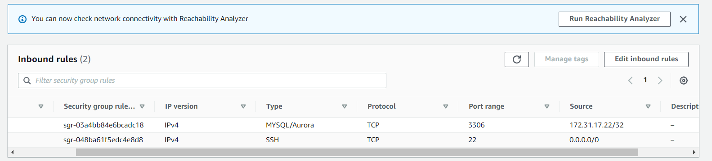
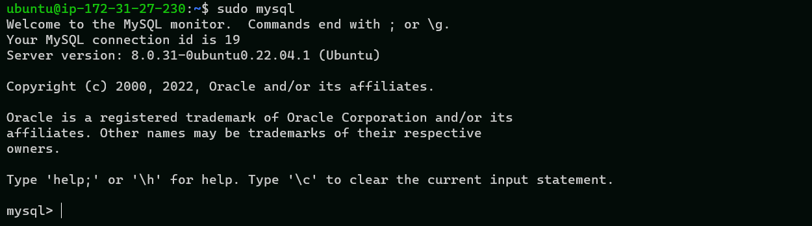

## PROJECT 5: CLIENT/SERVER ARCHITECTURE USING A MYSQL RELATIONAL DATABASE MANAGEMENT SYSTEM

First , I created and configured two Linux-based virtual servers (EC2 instances in AWS) and I named them as below:

Server A name - `mysql server`

Server B name - `mysql client`

Thereafter, I launched both instances

Next, on the mysql **SERVER** instance, I updated my packages, installed **mysql-server** and enabled the server by running the following commands:

`sudo apt update -y`

`sudo apt install mysql-server -y`

`sudo systemctl enable mysql`

Next, on the mysql **CLIENT** instance, I updated my packages and installed **mysql-client**  by running the following commands:

`sudo apt update -y`

`sudo apt install mysql-client -y`

Next, I opened up port 3306 on the mysql-server security group and I restricted traffic to the ip address of the mysql-client, as shown below

Next, on the server instance, I ran the command below:

`sudo mysql_secure_installation` and I completed the installation

Next, I ran the command below

`sudo mysql`

